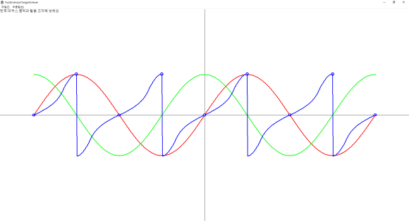

# OverPassTangent 
glm 폴더는 
삼각함수와 또 PI를 가져오기 위한 유틸 
그리고 vec2를 쓴 이유는 vec3로 가기 위해서 
즉 3차원 삼각함수를 만들기 위한 포석임. 
 
Chaos_Trigonometric_test 프로젝트는 삼각함수를 클래스화 시킨 dll 
TwoDmensionTangentViewer 프로젝트는 위의 dll를 실행하기 위한 프로그램 입니다. 
 
/* 
 * Creator : Choi HyoSeok (goto co[kr] Chaos) 
 * Phone : 010-7121-6633 
 * Copyright 2022. Chaos. all rights reserved. 
 * 
 * Data(Init) : 2022-1021_2131 (초기 버전) 
 * Data(Second) : 2024-0129_1853 (화면 출력 더블 버퍼링 적용) 
 * Data(Third)  : 2025-0714_1628 (클래스의 객체로 삼각함수 표시) : CMyDrawTrigonometirc 
 *                  CMyDrawTrigonometirc에서 스마트 포인터로 구현된 gdi 헨들로 자동 해제 기법 적용함 
 * Data(Fourth) : 2025-0717_1607 (화면 깜박임 문제 해결) : InvalidateRect(hWnd, nullptr, false); 에서 마지막 값을 
 *                  false 로 수정 후 화면 깜박임 문제 해결 
 *                  SpGdi.h 를 SSGdi.h 로 변경[DeleteObject(); 자동 호출에서 시스템 자원은 삭제 못 하게 변경 추가] 
 * Data(Fifth) : 2026-0706_1803 (glm 1.0.3 버전 변경) : 속성 링크 재설정 
 *                  속성 링크 문제 해결 
 */ 
 
 